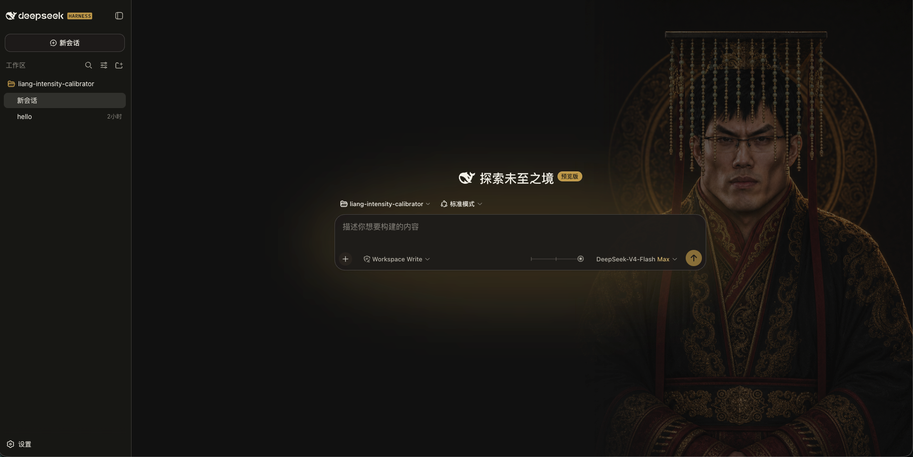
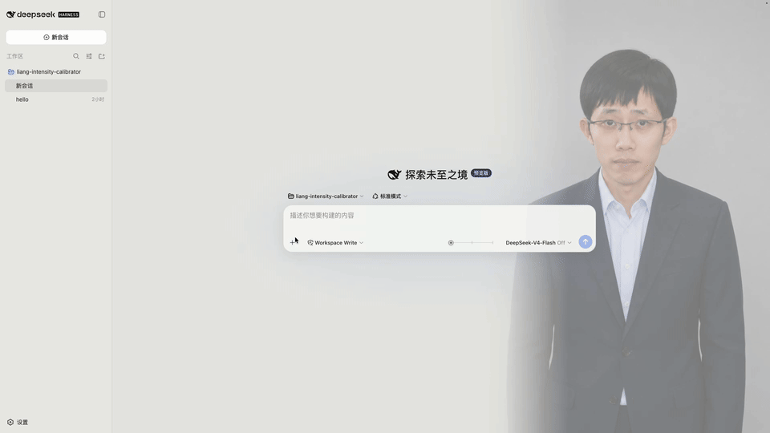

# 滑动变祖 · DeepSeek Harness 皮肤

复制给你的 DSH，一键安装：

```text
帮我安装这个仓库的皮肤到我的 DSH，地址：https://github.com/kingOfSoySauce/dsh-liang-skin
```

## 更多 DSH 皮肤

[前往 DSH 皮肤市场，浏览更多社区皮肤](https://kingofsoysauce.github.io/dsh-skin-market/)

[安装皮肤市场或提交皮肤](https://github.com/kingOfSoySauce/dsh-skin-market)

## 效果展示

<table>
  <tr>
    <td width="50%" align="center">
      
      <br>
      <sub>完整皮肤效果</sub>
    </td>
    <td width="50%" align="center">
      
      <br>
      <sub>推理等级滑块演示</sub>
    </td>
  </tr>
</table>

把 Harness 的推理等级改为紧凑滑块，并用滑动变祖原项目的 0–30 强度映射同步人物、背景与界面配色。

## 交互规则

- 档位直接读取当前模型的 `reasoning.efforts`，不写死数量或名称。
- 任意 N 个档位均匀落在 0–30：两档为 `0 / 30`，三档为 `0 / 15 / 30`，五档为 `0 / 7.5 / 15 / 22.5 / 30`。
- 拖动期间只做连续视觉预览；指针松开、键盘操作完成或控件失焦时，才吸附到最近档位并通过官方 ModelDirectory 提交该档位原始 ID。
- 不支持推理或只有一个可选档位的模型不显示滑块。
- addressed subagent 不显示也不提交滑块。

## 外观开关

入口位于 `设置 → 通用设置 → 外观皮肤`：

- `滑动变祖`：显示滑块并启用人物、背景和自适应配色。
- `原生`：移除背景层、皮肤变量和滑块，恢复 Harness 原生界面。

选择保存在当前浏览器本地，不会改动模型配置。

## 安装

需要先安装 DeepSeek Harness CLI；当前版本已在 `0.1.0-rc.6` 上验证。安装本身可以在 DSH 运行时执行（只改动磁盘配置），重启后生效。三种方式任选其一：

### 方式一：从 GitHub 安装（固定 release tag）

```sh
dsh plugin --profile web add 'github:kingOfSoySauce/dsh-liang-skin#v0.1.4'
dsh --profile web --dump-config | grep -B1 -A2 liang-intensity
```

版本号固定为已验证的 release tag，之后推送到 `main` 的改动不会静默改变已安装代码。

### 方式二：从 GitHub Release tarball 安装

从本仓库 [Releases](https://github.com/kingOfSoySauce/dsh-liang-skin/releases) 页面下载 `dsh-client-liang-intensity-skin-0.1.4.tgz`（包内已包含构建好的 `lib/client.js`，安装时不需要执行任何 prepare 脚本），然后：

```sh
dsh plugin --profile web add ./dsh-client-liang-intensity-skin-0.1.4.tgz
```

适合不方便走 git 的环境；相对路径按你运行命令的目录解析。

### 方式三：克隆后从本地路径安装（开发迭代）

```sh
git clone https://github.com/kingOfSoySauce/dsh-liang-skin.git
cd dsh-liang-skin
dsh plugin --profile web add .
```

`dsh plugin` 会把相对路径锚定到**你运行命令的目录**（而不是 profile 目录），所以在克隆目录里执行 `add .` 装的是指向克隆目录的 link 依赖：改完源码运行 `npm run build`，重启 DSH 即生效，无需重新安装。

### 验证与重启

安装成功后 `dsh plugin` 会自动把插件注册进 profile 的 `dsh.profile.bundles`（见 `~/.dsh/profiles/web/package.json`），无需手动改配置；`--dump-config` 的输出中应出现 `dsh-client-liang-intensity-skin` 配置层（上面命令里的 grep 就是为此准备的）。

如果正式 DSH 正在运行，让执行安装的 agent 给用户两个选择：

- **a. agent 自行重启**：agent 终止旧进程后重新运行 `dsh web`；
- **b. 用户手动重启（推荐）**：在运行 DSH 的终端按 Ctrl+C，再运行 `dsh web`。

重启后浏览器会自动加载新的客户端插件，无需强制刷新。当前会话会中断，但 DSH 会话有磁盘持久化，重启后可以恢复。

### 卸载

```sh
dsh plugin --profile web remove dsh-client-liang-intensity-skin
```

`remove` 会自动把插件从 `dsh.profile.bundles` 中摘除；重启后设置入口完全移除。

### 常见问题

- **pnpm 阻止构建脚本**：pnpm ≥ 10 默认不执行第三方依赖的 build/prepare 脚本。当前皮肤没有 prepare 脚本，正常不会触发；若 pnpm 安装失败并给出提示，按 dsh 打印的说明在 `~/.dsh/profiles/web/pnpm-workspace.yaml` 的 `allowBuilds` 下加入对应 key 后重试。
- **网络**：方式一需要能访问 github.com（pnpm 经 codeload 拉取）；方式二只需能下载 GitHub Release 附件。
- **pnpm 缺失**：`dsh plugin` 依赖 PATH 里的 pnpm，缺失时会明确提示。
- **端口占用**：`dsh web` 默认监听 3080（可用 `--port` 修改），重启前确认旧进程已退出。

## 本地开发

```sh
npm install
npm test
npm run build
```

修改 client 源码后需要运行 `npm run build`，并一起提交更新后的 `lib/client.js` 和 source map。

## 灵感与素材来源

本插件的“滑动变祖”视觉概念、人物图片与插帧视频素材源自
[Lichtspektrum/liang-intensity-calibrator](https://github.com/Lichtspektrum/liang-intensity-calibrator)。插件在原项目 0–30 强度轴的基础上，将视觉变化接入 DeepSeek Harness 的推理等级选择。

运行时素材已包含在插件中，安装后不需要额外下载。当前接入 24 张经过审核的人像锚点，滑动时直接切换最近锚点，不做图片交叉渐变。
